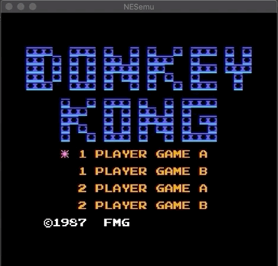

# NESemu
Very simple NES emulator

Had some time between Christmas and New Year, quickly put this emulator together as that's something I had always wanted to do. Also used the opportunity to play with modern C++ features. Putting this out there in case I want to come back to it or if it can help anybody. 

This is *completely* unfinished. It can run simple games (Donkey Kong, Balloon Fight, PacMan, Mario, ...). Controller: A,S (for A and B buttons) and Q,W (Start, Select). Need to compile with the ROM path.

CPU instructions are parsed by python script from CSV to create a file with all the different functions, this is a brute force method and could definitely be made simpler by implementing more decoding in the code

